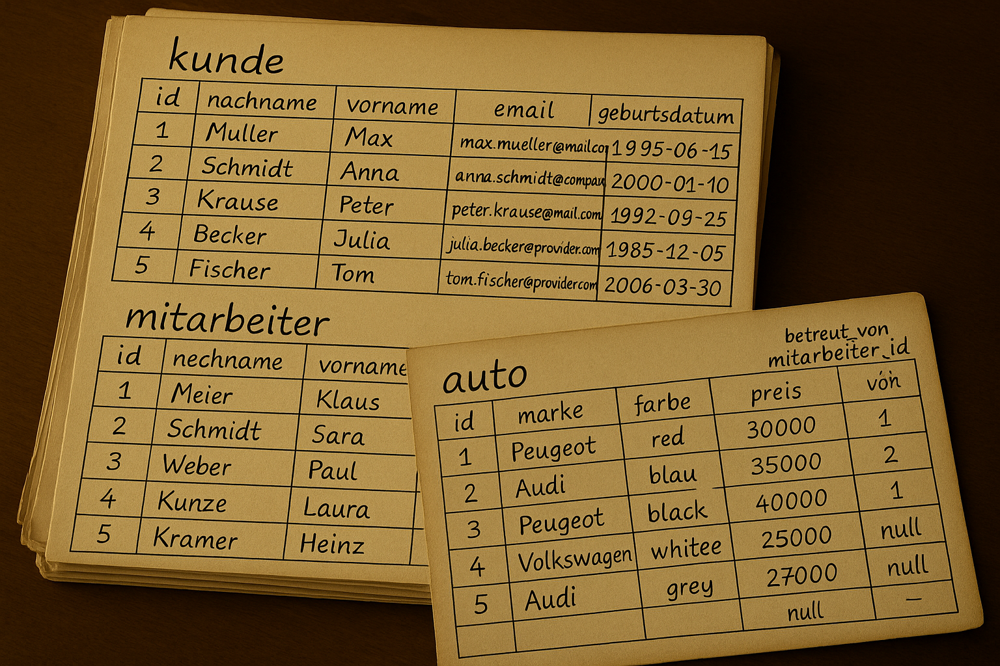

# Übung
**Datenbanken**

Der Autohändler "Cars4You" möchte seine alten handgeschriebenen Dokumente von uns in ein modernes Datenbanksystem umwandeln lassen.

---

# Quellcode

https://l.itsnameless.de/sqlrepo

---

# Hinweise 

> Die Aufgaben sind recht offen gestaltet, damit ihr mitdenkt. Welche Eigenschaften müssen die Attribute noch besitzen, die *nicht* explizit erwähnt sind? (zum Beispiel `NOT NULL`, ...)

> Die Beispieldaten wurden mittels ChatGPT erstellt und nicht explizit überprüft. Es ist Vorsicht geboten!

---

### Verwendung des DB-Tools

Siehe [DBTool Anleitung](DBTOOL.md)

---

### Emergency-Befehle

> Hast du vergessen, wie deine Tabellen heißen? Musst du dir schnell die Inhalte anzeigen? Hier sind die Befehle:

| Problem                           | Befehl                      |
| --------------------------------- | --------------------------- |
| Alle Tabellen auflisten           | `SHOW TABLES;`              |
| Alle Daten einer Tabelle anzeigen | `SELECT * FROM testtable;`  |
| Tabelle zurücksetzen              | `TRUNCATE TABLE testtable;` |

---

# Aufgabe 1

> Unser Vorgesetzter hat mit dem Geschäftsführer des Autohauses gesprochen und Informationen erhalten, die wir nun umsetzen müssen. Dafür erstellen wir zunächst ein ERM.

---

### ERM

1. Lies das nachfolgende Interview und arbeite die wichtigsten Informationen heraus.
    - der Einfachheit halber sind Klassen **fett** und Attribute *kursiv* markiert.
2. Erstelle daraus nun ein ERM.

---

### ERM - Interview

> Beschreiben sie einmal ihre Datenstruktur.

Am wichtigsten sind natürlich unsere **Kunden**. Wir haben viele davon und speichern Informationen wie *Vor- und Nachname*, *Geburtsdatum*, *E-Mail* und ganz wichtig für unser Marketing sind die *gekauften Autos*.

> Was speichern sie über ihre **Autos**?

Wir speichern *Marke*, *Farbe* und *Preis*. Außerdem müssen wir erkennen können, ob das Auto *verkauft* wurde.

> Speichern sie noch andere Daten?

Natürlich, unsere **Mitarbeiter**. Jeder Mitarbeiter ist für mehrere Autos **verantwortlich**. Also diese verkaufen die Autos und erhalten entsprechend die Provision. Auch über die Mitarbeiter wissen wir das selbe wie über Kunden, nur ohne das Geburtsdatum.

---

# Aufgabe 2

> Nun wollen wir die Datenbank vorbereiten, um die Daten speichern zu können. Dafür benötigen wir Tabellen.

---

### Tabellen - Grundlagen

1. Erstelle die Tabelle `customer` mit den geforderten Eigenschaften aus dem ERM:
    - nutze für `id` die Eigenschaften `AUTO_INCREMENT`, `PRIMARY KEY`
    - nutze für `birthday` den Datentyp `DATETIME`.
2. Erstelle ähnlich dazu die Tabelle `employee`.

---

### Tabellen - Fremdschlüssel

> Wie müssen wir die Relationen gestalten?

---

### Tabellen - Fremdschlüssel

3. Erstelle die Tabelle `car` mit den geforderten Eigenschaften aus dem ERM mit den zusätzlichen Attributen:
    - **Beachte!** Was soll passieren, wenn ein Mitarbeiter / Kunde gelöscht wird?
    - `managed_by_employee_id` : Fremdschlüssel zum Mitarbeiter, der das Auto verwaltet
    - `bought_by_customer_id` : Fremdschlüssel zum Kunden, der das Auto gekauft hat.

---

### Daten einfügen

4. Füge nun einige Datensätze ein.

---

# Aufgabe 3

> Eine Kundin hat nun ein Auto gekauft und jemand anders möchte seine Daten gelöscht haben. Nun wollen wir das in der Datenbank entsprechend ändern.

---

### Daten verändern

1. Julia Becker hat den weißen Volkswagen gekauft.
    - Was muss gemacht werden?
2. Anna Schmidt möchte, dass all ihre Daten gelöscht werden.
    - Wie kann das gemacht werden?
    - War unsere Entscheidung für `ON DELETE` bei der Verknüpfung richtig?
    - Was ist nun die beste Alternative?

---

# Aufgabe 4

> Unsere Daten sind nun schön Übersichtlich! Der Geschäftsführer hat nun einige Nachfragen. Erstelle eine passende Query und beantworte die Fragen.

> Rate nicht und suche nicht manuell!

> Versuche alleine die notwendigsten Daten zu selektieren!

---

### Abfragen - Grundlagen

1. Wie viele Mitarbeiter sind aktuell im Unternehmen angestellt?
2. Wir möchten mit dem Vornamen personalisierte Werbe-E-Mails verschicken.
    1. Welche Namen und E-Mail-Adressen brauchen wir dafür?
    2. Welche dieser Kunden sind zwischen 30 und 35 Jahre alt?
3. Welche verschiedenen Automarken werden angeboten?
    1. Gib die Liste geordnet zurück.
    2. Wie viele Autos gibt es von jeder Marke?
4. Was ist der Gesamtwert aller Autos im Autohaus?

---

### Abfragen - Komplex

> Diese Aufgaben können mittels `join`  / Tabellenverknüpfung gelöst werden. Da dies nicht klausurrelevant ist, kannst du auch mehrere einzelne Queries nutzen.

5. Welche Mitarbeiter haben Autos an Max Müller verkauft?
6. Welche Mitarbeiter haben noch unverkaufte Autos?
7. Jeder Mitarbeiter erhält 15% Provision pro verkauftes Auto.
    - Wie viel Provision erhielte Paul Weber, wenn er alle seine Autos verkauft?
    - Führe die Berechnung in SQL durch.
8. Es gab einen Hack beim E-Mail-Provider `mail.com`. Welche E-Mail-Adressen dieses Providers stehen in unserem System?

---

# Feedback

Hat euch diese Stunde sehr gut gefallen? War sie absolut schrecklich? Das ist mir *nicht* egal! Also lasst Feedback da!

https://l.itsnameless.de/practice

---
# Vielen Dank für eure Aufmerksamkeit!

https://social.itsnameless.de

