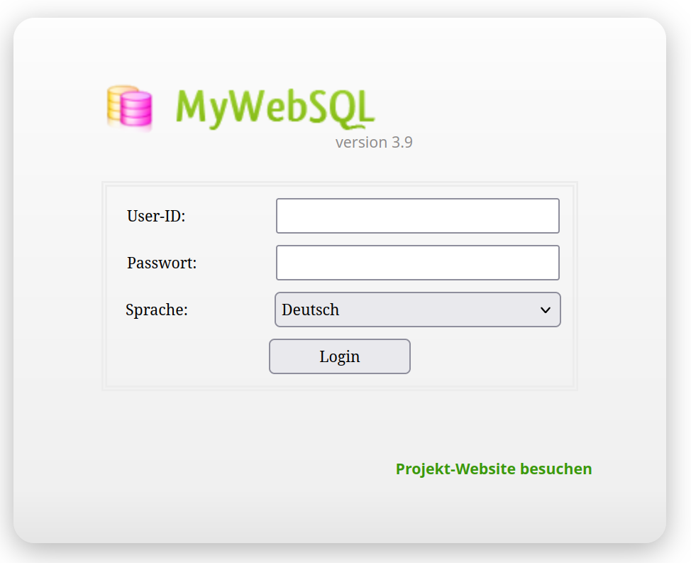
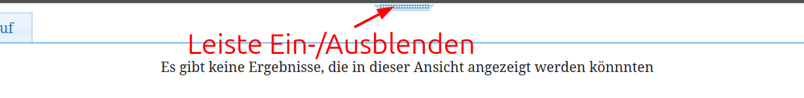
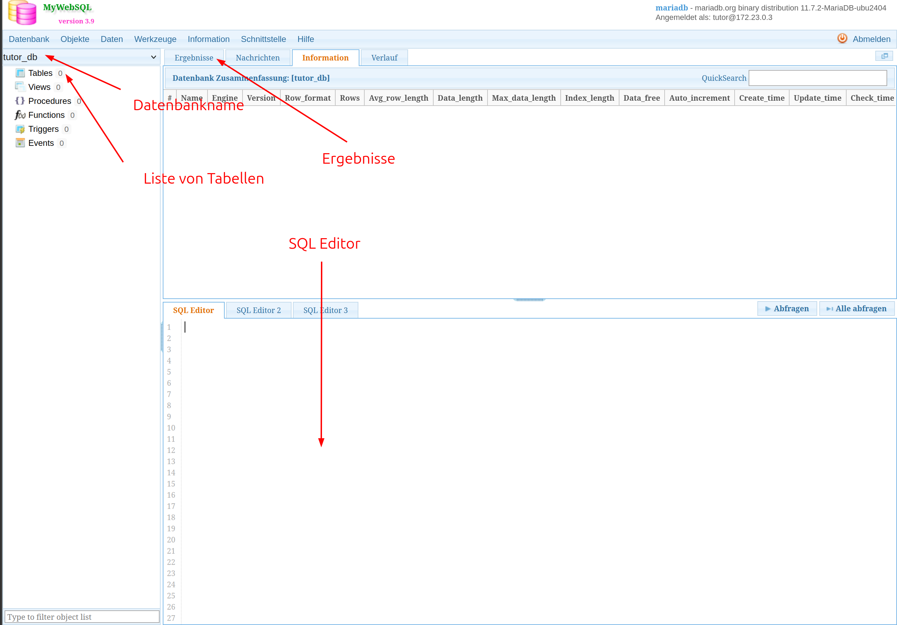
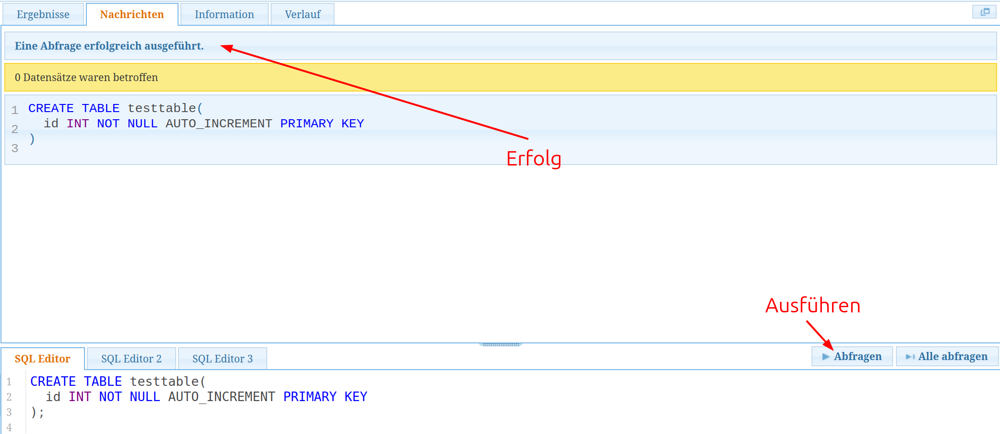
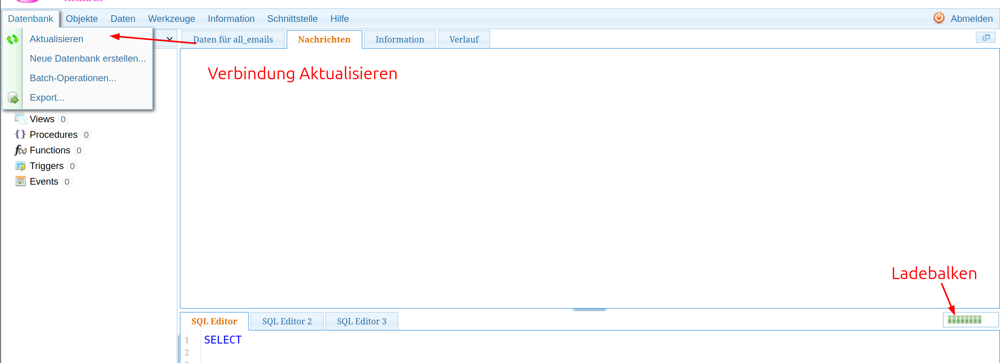
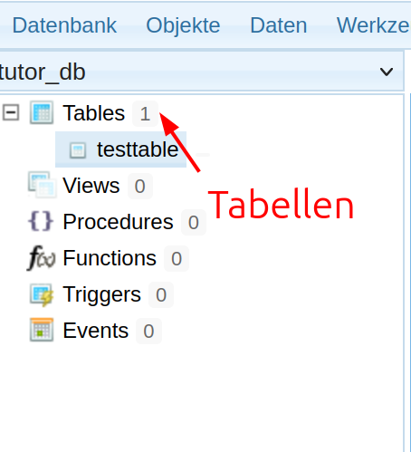

# Verwendung des DB-Tools

> Zur Vereinfachung und Beschleunigung der Übung nutzen wir ein Online-Datenbank-Tool.

https://sqltraining.itsnameless.de

---

## Login

> Hier könnt ihr euch mit den Daten einloggen, die ich euch geschickt habe.

---

## Seitenleisten

> Falls die obere, untere und linke Leiste ausgeblendet sein, können diese über diese "Griffe" eingeblendet werden.

---

## Übersicht

> Übersicht des Programms.

---

## Befehlsausführung

> Befehle werden im Editor eingegeben und mittels Abfragen ausgeführt. Bei Nachrichten erscheint der Status, bei Ergebnisse das Ergebnis (bei Abfragen).

---

## Fehler

> Leider ist MyWebSQL nicht das beste Tool. Ist ein Fehler im SQL-Befehl, hängt sich die Query auf. Das erkennt man am unendlichen Ladebalken. Über `Datenbank > Aktualisieren` kannst du die Query abbrechen.

---

## Tabellen

> Mit einem Klick auf einen Tabellennamen kann einfach der Befehl `SELECT * FROM <table>;` ausgeführt werden.
