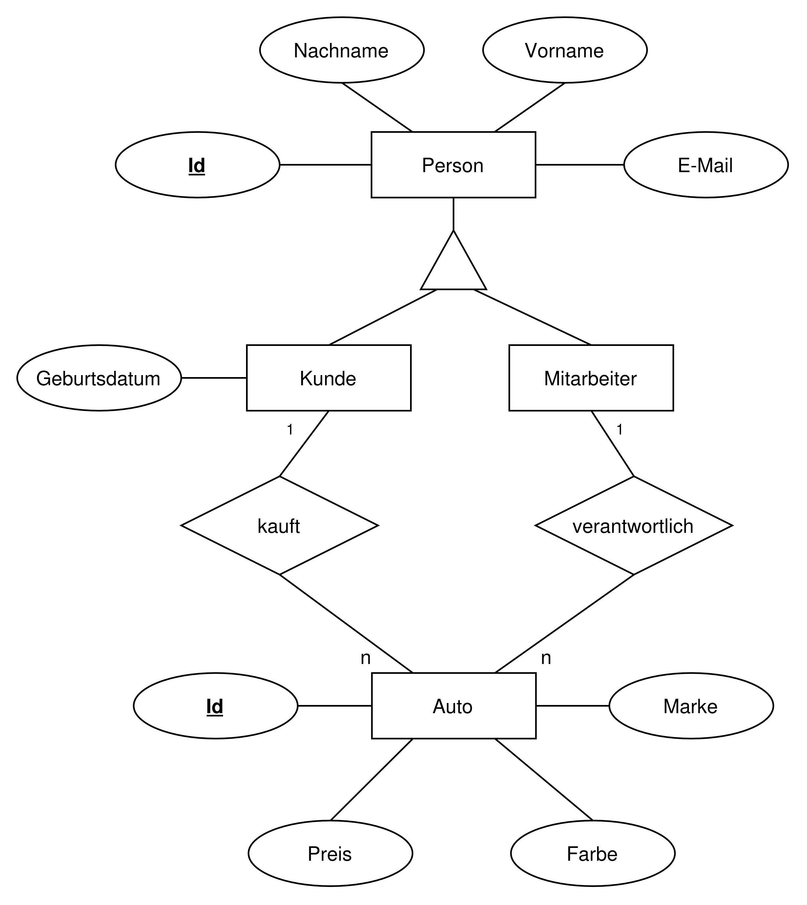

# Lösung Aufgabe 1

## 1.

1. Lies das nachfolgende Interview und arbeite die wichtigsten Informationen heraus.

### Klassen

> Am wichtigsten sind natürlich unsere **Kunden**. Wir haben viele davon und speichern Informationen wie _Vor- und Nachname_, _Geburtsdatum_, _E-Mail_ und ganz wichtig für unser Marketing sind die _gekauften Autos_.

Wir benötigen eine **Klasse Kunde** mit den **Attributen**:

-   Vorname
-   Nachname
-   Geburtsdatum
-   E-Mail

Die _gekauften Autos_ müssen wir nicht als Attribut darstellen, da wir nachfolgend an den Autos den Käufer markieren und darüber die Antwort erhalten.

> Wir speichern _Marke_, _Farbe_ und _Preis_. Außerdem müssen wir erkennen können, ob das Auto _verkauft_ wurde.

Wir benötigen eine **Klasse Auto** mit den **Attributen**:

-   Marke
-   Farbe
-   Preis

Auch das _verkauft_ Attribut müssen wir nicht als Attribut darstellen, da wir nachfolgend an den Autos den Käufer markieren und darüber die Antwort erhalten.

> Natürlich, unsere **Mitarbeiter**. Jeder Mitarbeiter ist für mehrere Autos **verantwortlich**. Also diese verkaufen die Autos und erhalten entsprechend die Provision. Auch über die Mitarbeiter wissen wir das selbe wie über Kunden, nur ohne das Geburtsdatum.

Wir benötigen eine **Klasse Mitarbeiter** mit den **Attributen**:

-   Vorname
-   Nachname
-   E-Mail

Uns fällt auf, dass _Kunden_ und _Mitarbeiter_ sehr ähnliche Attribute haben. Wir könnten hier eine **Vererbung** nutzen. Also nutzen wir eine **Klasse Person** mit den Attributen:

-   Vorname
-   Nachname
-   E-Mail

Die **Klasse Kunde** und die **Klasse Mitarbeiter** erben von der **Klasse Person**.

### Beziehungen

**Autos** werden von **Mitarbeitern** verwaltet. Also haben wir eine Beziehung zwischen **Auto** und **Mitarbeiter**.

Ein **Auto** wird von einem **Kunden** gekauft. Also haben wir eine Beziehung zwischen **Auto** und **Kunde**.

## 2.

2. Erstelle daraus nun ein ERM.

